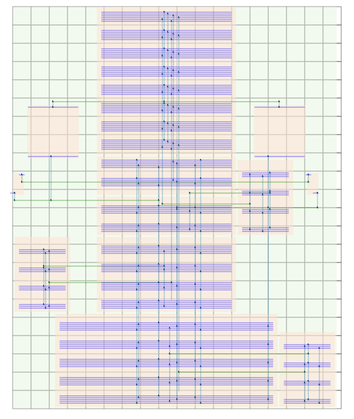

## AnalogDetailedRouter
[](https://circleci.com/gh/ALIGN-analoglayout/AnalogDetailedRouter)
[](https://www.codacy.com/app/ALIGN-analoglayout/AnalogDetailedRouter?utm_source=github.com&amp;utm_medium=referral&amp;utm_content=ALIGN-analoglayout/AnalogDetailedRouter&amp;utm_campaign=Badge_Grade)

This repository contains the Intel's Analog Detailed Router.
This tools takes as input:
* Abstract grid definition
* Terminals (Connected Entities)
* Existing wires (Pre-routes)
* Global Routes

and produces detailed routes like this:



### To build and test locally:
```bash
sudo apt-get update
sudo apt-get install g++ build-essential zlib1g-dev
make clean
make
(cd tests/vga && ../../bin/amsr.exe -file INPUT/ctrl.txt && diff out out-gold)
(cd tests/vga2 && ../../bin/amsr.exe -file INPUT/ctrl.txt && diff out out-gold)
(cd tests/vga3 && ../../bin/amsr.exe -file INPUT/ctrl.txt && diff out out-gold)
```

### To build and test using docker:
```bash
docker build -t intel_detailed_router .

docker run --name cp --mount source=rVol,target=/run ubuntu
docker cp tests/vga/INPUT cp:/run/INPUT
docker cp tests/vga/DR_COLLATERAL cp:/run/DR_COLLATERAL
docker cp tests/vga/out-gold cp:/run/out-gold
docker rm cp
docker run -it --mount source=rVol,target=/run intel_detailed_router bash -c "cd run && amsr.exe -file INPUT/ctrl.txt && diff out out-gold"
```


### To use pytest locally
```bash
sudo apt-get install python3 python3-pip python3-venv
python3 -m venv general
source general/bin/activate
pip install --upgrade install
pip install wheel pytest coverage pytest-cov
pytest
```

### Run pytest using docker
```bash
docker build -t build_intel_detailed_router . --target build_intel_detailed_router
docker run -it build_intel_detailed_router bash -c "source /general/bin/activate && cd /analog && pytest"
```

### License
BSD 3 clause

### Release Notes

First open source release

Current static code analysis issues:
* Minor memory leaks
* Divide by zero possible on incorrect inputs
